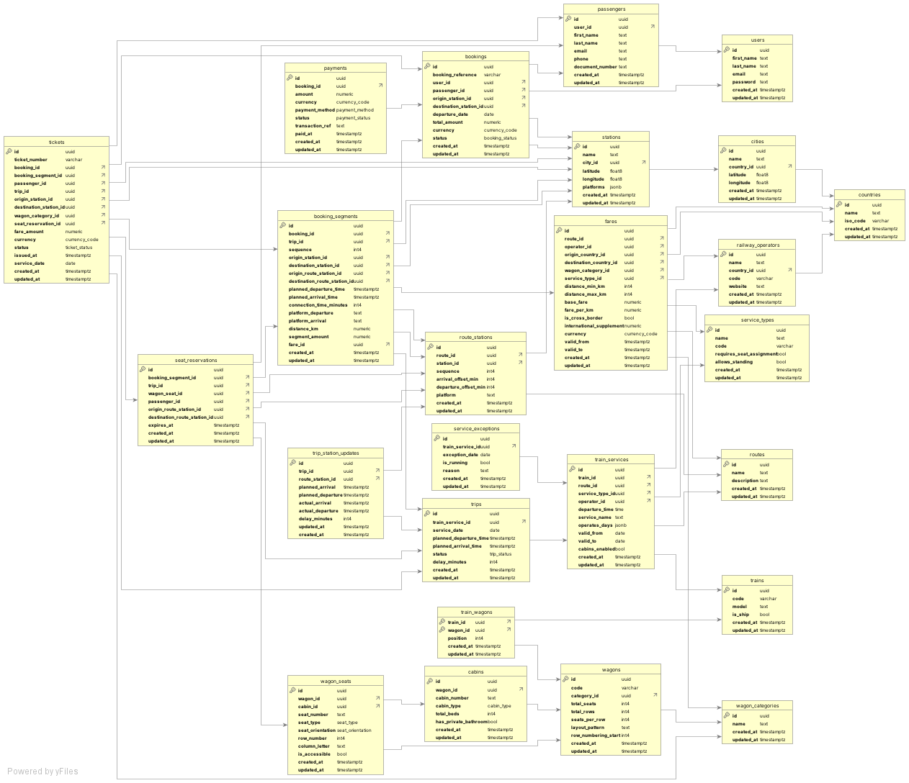

# Raylix 🚄

Sistema di gestione dati per prenotazioni ferroviarie sviluppato come progetto di tesi per la laurea in **Informatica per le Aziende Digitali (L-31)**.

## Obiettivo

Il progetto nasce dall'esigenza di progettare un modello di persistenza dati robusto per il settore dei trasporti ferroviari. L'obiettivo è gestire la complessità dei sistemi di prenotazione reali: viaggi con cambi, orari variabili, operatori internazionali e tipologie di posto diverse.

Durante l'analisi del dominio, è emersa la necessità di supportare scenari complessi come viaggi intermodali (treno + traghetto), gestione di cabine per viaggi notturni, e coordinamento tra operatori di paesi diversi.

## Stack Tecnologico

### Database
- **PostgreSQL 17** - DBMS principale con supporto JSONB e indicizzazione avanzata
- **DBML** - Modellazione del database per documentazione e generazione schema
- **Adminer** - Interfaccia web per esplorazione e gestione dati

### Sviluppo e Testing
- **Docker Compose** - Ambiente di sviluppo containerizzato
- **Python 3.11+** - Generazione dati di test realistici
- **Faker** - Libreria per generazione dati campione

## Scelte Progettuali

### PostgreSQL come DBMS
La scelta di PostgreSQL è motivata da:
- **Integrità transazionale**: Essenziale per evitare sovraprenotazioni
- **Supporto JSONB**: Utilizzato per la gestione flessibile degli orari operativi
- **Indicizzazione avanzata**: Necessaria per query complesse di ricerca viaggi
- **Affidabilità**: Standard consolidato per applicazioni critiche

### Architettura Multi-Segmento
Il sistema gestisce viaggi complessi attraverso la tabella `booking_segments`, permettendo:
- Viaggi diretti e con cambi
- Tratte gestite da operatori diversi
- Calcolo preciso dei tempi di coincidenza
- Supporto per mezzi misti (treno + traghetto)

### Gestione Posti e Cabine
Implementata una struttura flessibile che supporta:
- Posti standard con preferenze (finestrino/corridoio)
- Cabine per viaggi notturni (cuccette, vagoni letto)
- Prenotazioni temporanee con scadenza automatica
- Gestione accessibilità

## Analisi del Database

## Tabelle
Per una descrizione dettagliata delle tabelle e dei loro attributi, consulta il file [`docs/TABLES.md`](docs/TABLES.md).

### Forme Normali
Il database è stato progettato seguendo rigorosamente le prime tre forme normali (1NF, 2NF, 3NF) con alcune denormalizzazioni strategiche per ottimizzare le performance. L'analisi completa documenta:
- **Rispetto delle regole di normalizzazione** per garantire integrità dei dati
- **Eliminazione delle dipendenze transitive** per evitare anomalie
- **Scelte di denormalizzazione consapevoli** per query critiche (prezzi, orari)

Per i dettagli tecnici: [`docs/NORMALIZATION.md`](docs/NORMALIZATION.md)

### Statistiche del Database
Il sistema di seed genera automaticamente:
- **24 tabelle** interconnesse con vincoli di integrità referenziale
- **Operatori ferroviari** realistici (Trenitalia, SNCF, DB, Renfe, ecc.)
- **Rete di stazioni** europea con coordinate geografiche precise
- **Servizi giornalieri** con orari e frequenze realistiche
- **Prenotazioni campione** per testare scenari complessi
- **Configurazioni treni** diversificate (alta velocità, regionali, notturni)

## Performance e Scalabilità

### Ottimizzazioni Implementate
- **Indici strategici** su campi frequentemente usati in JOIN e WHERE
- **Denormalizzazione selettiva** per query time-critical (calcolo prezzi, orari viaggio)
- **Enum PostgreSQL** per garantire integrità e performance sui stati
- **Vincoli di integrità** per prevenire stati inconsistenti del sistema

### Considerazioni di Scalabilità
Il design supporta:
- **Milioni di prenotazioni** attraverso indicizzazione ottimizzata
- **Query geografiche** veloci con indici su coordinate stazioni
- **Gestione concorrenza** per prenotazioni simultanee sullo stesso posto
- **Crescita temporale** dei dati storici senza degradazione performance

## Limitazioni del Progetto

Questo progetto si concentra esclusivamente sulla progettazione del modello dati. Non include:
- Interfaccia utente
- API di servizio
- Logica applicativa
- Sistema di pagamenti reale

## Possibili Sviluppi

Se dovessi continuare il progetto, le prossime cose da aggiungere sarebbero:

*   **API REST o GraphQL**: Per far comunicare app e siti web con il database
*   **Sistema di Prezzi Dinamici**: Estendere le tariffe per farle cambiare in base alla domanda o al tempo rimasto prima della partenza
*   **Cache per la Disponibilità**: Un sistema per calcolare velocemente quanti posti sono liberi senza dover interrogare tutto il database ogni volta
*   **Integrazioni Esterne**: Collegamento con sistemi di pagamento reali e magari con altri operatori per offrire più opzioni di viaggio
*   **Intelligenza Artificiale**: Usare tutti i dati raccolti per:
    *   Prevedere quanta gente vorrà viaggiare su certe tratte
    *   Suggerire viaggi personalizzati in base alle preferenze degli utenti
    *   Creare un chatbot intelligente per l'assistenza clienti

## Struttura Repository

```
raylix/
├── database/
│   ├── schema/
│   │   ├── schema.dbml          # Modello dati principale
│   │   └── database.sql         # Script DDL PostgreSQL
│   ├── seeds/                   # Generazione dati di test
│   └── queries/                 # Query di esempio per casi d'uso comuni
├── docs/
│   ├── tables.md               # Documentazione dettagliata tabelle
│   ├── normalization.md        # Analisi delle forme normali
│   └── er-diagram.png          # Diagramma entità-relazione
└── README.md
```

### Query di Esempio
Il progetto include query SQL per testare i casi d'uso principali:
- **`find_direct_trips.sql`** - Ricerca viaggi diretti tra due stazioni
- **`find_trip_paths.sql`** - Trova percorsi con cambi ottimali  
- **`calculate_fare.sql`** - Calcolo tariffe per segmenti di viaggio
- **`booking_history.sql`** - Storico prenotazioni per utente
- **`validate_ticket.sql`** - Validazione e controllo biglietti
- **`find_available_wagon_seats.sql`** - Verifica disponibilità posti

### Diagramma Entità-Relazione


Il diagramma mostra le 24 tabelle principali e le loro relazioni:
- **Entità core**: Users, Passengers, Bookings, Trips
- **Configurazione**: Trains, Wagons, Routes, Stations  
- **Operazioni**: Payments, Tickets, Seat Reservations

## Generazione Dati di Test

Il progetto include un sistema completo per generare dati realistici che permette di testare lo schema con scenari d'uso reali.

### Requisiti
- **Docker & Docker Compose** (approccio consigliato)
- **Oppure**: PostgreSQL locale + Python 3.11+

### Setup con Docker (Consigliato)

```bash
# Naviga nella cartella seeds
cd database/seeds

# Avvia l'ambiente completo
./run.sh
```

Questo comando:
- Crea un database PostgreSQL 17 sulla porta 5432
- Applica automaticamente lo schema del database
- Genera dati di test realistici (operatori, stazioni, treni, prenotazioni)
- Avvia Adminer su http://localhost:8080 per esplorare i dati

### Setup Manuale

```bash
# 1. Crea il database
createdb raylix

# 2. Applica lo schema
psql -d raylix -f database/schema/database.sql

# 3. Installa dipendenze Python
cd database/seeds
pip install -r requirements.txt

# 4. Crea il file .env con le variabili d'ambiente
echo "DB_NAME=raylix
DB_USER=postgres
DB_PASSWORD=postgres
DB_HOST=localhost
DB_PORT=5432" > .env

# 4. Genera i dati di test
python generate_seed_data.py
```

### Esplorazione Dati

Una volta completato il setup, puoi:
- **Accedere ad Adminer**: http://localhost:8080 (user: postgres, password: postgres)
- **Connetterti via psql**: `psql -h localhost -d raylix -U postgres`
- **Eseguire le query di esempio** dalla cartella `database/queries/`

## Licenza e Autore

Questo progetto è distribuito sotto licenza MIT. Vedi il file [LICENSE](LICENSE) per i dettagli.

**Giuseppe Cutuli** - Progetto di tesi per Informatica per le Aziende Digitali (L-31)  
GitHub: [@giuseppecutuli](https://github.com/giuseppecutuli)
