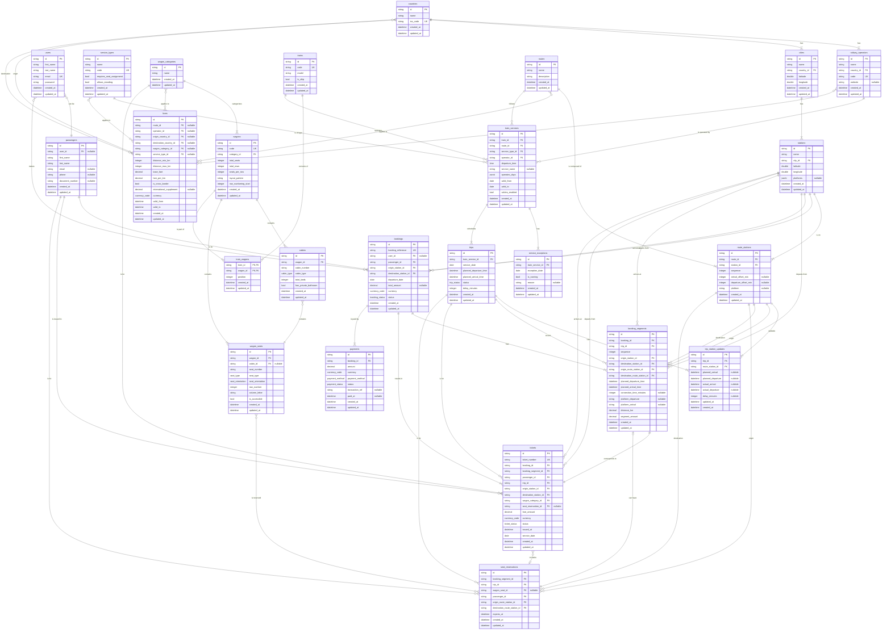

```mermaid
erDiagram
    countries {
        string id PK
        string name
        string iso_code UK
        datetime created_at
        datetime updated_at
    }

    railway_operators {
        string id PK
        string name
        string country_id FK
        string code UK
        string website "nullable"
        datetime created_at
        datetime updated_at
    }

    cities {
        string id PK
        string name
        string country_id FK
        double latitude
        double longitude
        datetime created_at
        datetime updated_at
    }

    stations {
        string id PK
        string name
        string city_id FK
        double latitude
        double longitude
        jsonb platforms "nullable"
        datetime created_at
        datetime updated_at
    }

    users {
        string id PK
        string first_name
        string last_name
        string email UK
        string password
        datetime created_at
        datetime updated_at
    }

    passengers {
        string id PK
        string user_id FK "nullable"
        string first_name
        string last_name
        string email "nullable"
        string phone "nullable"
        string document_number "nullable"
        datetime created_at
        datetime updated_at
    }

    service_types {
        string id PK
        string name
        string code UK
        bool requires_seat_assignment
        bool allows_standing
        datetime created_at
        datetime updated_at
    }

    wagon_categories {
        string id PK
        string name
        datetime created_at
        datetime updated_at
    }

    wagons {
        string id PK
        string code UK
        string category_id FK
        integer total_seats
        integer total_rows
        integer seats_per_row
        string layout_pattern
        integer row_numbering_start
        datetime created_at
        datetime updated_at
    }

    cabins {
        string id PK
        string wagon_id FK
        string cabin_number
        cabin_type cabin_type
        integer total_beds
        bool has_private_bathroom
        datetime created_at
        datetime updated_at
    }

    wagon_seats {
        string id PK
        string wagon_id FK
        string cabin_id FK "nullable"
        string seat_number
        seat_type seat_type
        seat_orientation seat_orientation
        integer row_number
        string column_letter
        bool is_accessible
        datetime created_at
        datetime updated_at
    }

    trains {
        string id PK
        string code UK
        string model
        bool is_ship
        datetime created_at
        datetime updated_at
    }

    train_wagons {
        string train_id PK, FK
        string wagon_id PK, FK
        integer position
        datetime created_at
        datetime updated_at
    }

    routes {
        string id PK
        string name
        string description
        datetime created_at
        datetime updated_at
    }

    route_stations {
        string id PK
        string route_id FK
        string station_id FK
        integer sequence
        integer arrival_offset_min "nullable"
        integer departure_offset_min "nullable"
        string platform "nullable"
        datetime created_at
        datetime updated_at
    }

    train_services {
        string id PK
        string train_id FK
        string route_id FK
        string service_type_id FK
        string operator_id FK
        time departure_time
        string service_name "nullable"
        jsonb operates_days
        date valid_from
        date valid_to
        bool cabins_enabled
        datetime created_at
        datetime updated_at
    }

    service_exceptions {
        string id PK
        string train_service_id FK
        date exception_date
        bool is_running
        string reason "nullable"
        datetime created_at
        datetime updated_at
    }

    trips {
        string id PK
        string train_service_id FK
        date service_date
        datetime planned_departure_time
        datetime planned_arrival_time
        trip_status status
        integer delay_minutes
        datetime created_at
        datetime updated_at
    }

    trip_station_updates {
        string id PK
        string trip_id FK
        string route_station_id FK
        datetime planned_arrival "nullable"
        datetime planned_departure "nullable"
        datetime actual_arrival "nullable"
        datetime actual_departure "nullable"
        integer delay_minutes "nullable"
        datetime updated_at
        datetime created_at
    }

    bookings {
        string id PK
        string booking_reference UK
        string user_id FK "nullable"
        string passenger_id FK
        string origin_station_id FK
        string destination_station_id FK
        date departure_date
        decimal total_amount "nullable"
        currency_code currency
        booking_status status
        datetime created_at
        datetime updated_at
    }

    booking_segments {
        string id PK
        string booking_id FK
        string trip_id FK
        integer sequence
        string origin_station_id FK
        string destination_station_id FK
        string origin_route_station_id FK
        string destination_route_station_id FK
        datetime planned_departure_time
        datetime planned_arrival_time
        integer connection_time_minutes "nullable"
        string platform_departure "nullable"
        string platform_arrival "nullable"
        decimal distance_km
        decimal segment_amount
        datetime created_at
        datetime updated_at
    }

    fares {
        string id PK
        string route_id FK "nullable"
        string operator_id FK "nullable"
        string origin_country_id FK "nullable"
        string destination_country_id FK "nullable"
        string wagon_category_id FK "nullable"
        string service_type_id FK "nullable"
        integer distance_min_km
        integer distance_max_km
        decimal base_fare
        decimal fare_per_km
        bool is_cross_border
        decimal international_supplement "nullable"
        currency_code currency
        datetime valid_from
        datetime valid_to
        datetime created_at
        datetime updated_at
    }

    seat_reservations {
        string id PK
        string booking_segment_id FK
        string trip_id FK
        string wagon_seat_id FK "nullable"
        string passenger_id FK
        string origin_route_station_id FK
        string destination_route_station_id FK
        datetime expires_at
        datetime created_at
        datetime updated_at
    }

    tickets {
        string id PK
        string ticket_number UK
        string booking_id FK
        string booking_segment_id FK
        string passenger_id FK
        string trip_id FK
        string origin_station_id FK
        string destination_station_id FK
        string wagon_category_id FK
        string seat_reservation_id FK "nullable"
        decimal fare_amount
        currency_code currency
        ticket_status status
        datetime issued_at
        date service_date
        datetime created_at
        datetime updated_at
    }

    payments {
        string id PK
        string booking_id FK
        decimal amount
        currency_code currency
        payment_method payment_method
        payment_status status
        string transaction_ref "nullable"
        datetime paid_at "nullable"
        datetime created_at
        datetime updated_at
    }

    countries ||--|{ railway_operators : "has"
    countries ||--|{ cities : "has"
    countries }o--o{ fares : "origin"
    countries }o--o{ fares : "destination"
    cities ||--|{ stations : "has"
    users }o--|| passengers : "can be"
    wagon_categories ||--|{ wagons : "categorizes"
    wagon_categories }o--o{ fares : "applies to"
    wagon_categories ||--o{ tickets : "is for"
    wagons ||--|{ cabins : "contains"
    wagons ||--|{ wagon_seats : "contains"
    cabins }o--|| wagon_seats : "contains"
    trains ||--|{ train_wagons : "consists of"
    wagons ||--|{ train_wagons : "is part of"
    routes ||--|{ route_stations : "is composed of"
    routes }o--o{ fares : "applies to"
    stations ||--|{ route_stations : "is on"
    trains ||--o{ train_services : "operates"
    routes ||--o{ train_services : "follows"
    service_types ||--o{ train_services : "is of type"
    service_types }o--o{ fares : "applies to"
    railway_operators ||--o{ train_services : "is operated by"
    railway_operators }o--o{ fares : "defines"
    train_services ||--|{ service_exceptions : "has"
    train_services ||--|{ trips : "schedules"
    trips ||--|{ trip_station_updates : "has"
    route_stations ||--|{ trip_station_updates : "updates"
    route_stations ||--o{ booking_segments : "origin"
    route_stations ||--o{ booking_segments : "destination"
    route_stations ||--o{ seat_reservations : "origin"
    route_stations ||--o{ seat_reservations : "destination"
    users }o--o{ bookings : "makes"
    passengers ||--o{ bookings : "is for"
    stations ||--o{ bookings : "departs from"
    stations ||--o{ bookings : "arrives at"
    stations ||--o{ booking_segments : "departs from"
    stations ||--o{ booking_segments : "arrives at"
    stations ||--o{ tickets : "departs from"
    stations ||--o{ tickets : "arrives at"
    bookings ||--|{ booking_segments : "has"
    trips ||--o{ booking_segments : "covers"
    bookings ||--|{ tickets : "results in"
    bookings ||--|{ payments : "is paid by"
    booking_segments ||--|| tickets : "corresponds to"
    passengers ||--o{ tickets : "is issued to"
    trips ||--o{ tickets : "is for"
    booking_segments |o--|| seat_reservations : "can have"
    wagon_seats }o--o{ seat_reservations : "is reserved"
    passengers ||--o{ seat_reservations : "is for"
    trips ||--o{ seat_reservations : "is for"
    tickets }o--o| seat_reservations : "includes"
```
